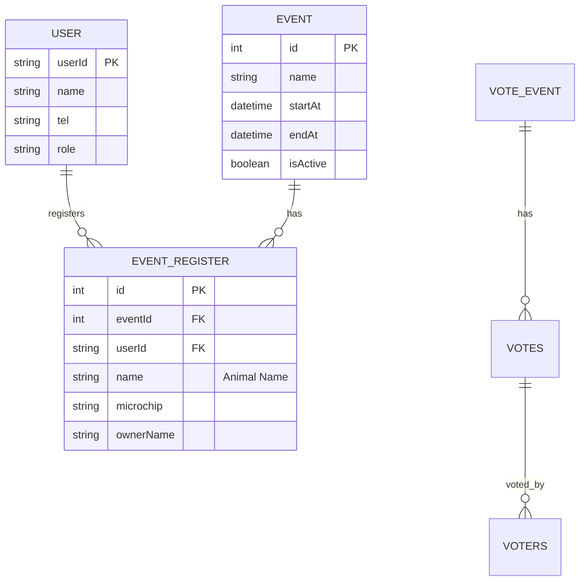

# Project Map: jaothui-event

##  Filosofia (Philosophy)
ระบบจัดการอีเวนต์และการลงทะเบียนสำหรับการประกวดควายไทยในเครือ **เจ้าทุย (Jaothui)** เน้นความถูกต้องของข้อมูลสายพันธุ์ (Pedigree) ความโปร่งใสในการตัดสิน และความสะดวกในการลงทะเบียนทั้งสำหรับผู้ใช้ทั่วไปและเจ้าหน้าที่ (Admin) หน้างาน

- **Vibe**: Professional, Traditional yet Modernized, Secure, Scalable.
- **Core Goal**: Digital Transformation สำหรับวงการความงามควายไทย

## 🏗️ Architecture & Stack
- **Framework**: [Next.js 14](https://nextjs.org/) (T3 Stack Base - Mix of Pages/App Router)
- **Language**: [TypeScript](https://www.typescript.org/) (Strict Type Law)
- **API Strategy**: [tRPC](https://trpc.io/) (End-to-end typesafety)
- **Database / ORM**: [PostgreSQL](https://www.postgresql.org/) + [Prisma](https://www.prisma.io/)
- **Integration**:
  - [LINE LIFF](https://developers.line.biz/en/docs/liff/) (User Entry Point)
  - [Sanity CMS](https://www.sanity.io/) (Content Management)
  - [Supabase](https://supabase.com/) (Storage/Auth Helpers)
  - [Viem](https://viem.sh/) (Blockchain Verification)
- **Testing**: [Vitest](https://vitest.dev/) (Root-level TDD)

## 🗺️ Key Landmarks
- [src/server/api/routers/](src/server/api/routers/): แหล่งรวม tRPC Routers (Admin, Event, Register, User)
- [src/server/services/](src/server/services/): Business Logic Layer แยกออกจาก Router (e.g., `event-visibility.service.ts`)
- [prisma/schema.prisma](prisma/schema.prisma): Database Blueprint
- [tests/](tests/): ศูนย์รวม Unit Tests (อยู่นอก `src/` ตามความต้องการของคุณนนท์)
- [sanity/](sanity/): การตั้งค่า Schema และ Content สำหรับ Sanity Studio

## � Database Schema (Prisma)
โครงสร้างข้อมูลหลักเน้นความสัมพันธ์ระหว่างเจ้าของ (User) และการลงทะเบียนอีเวนต์ (EventRegister)

## �🔄 Data Flow
1. **User Side**: LINE LIFF -> [Next.js Frontend] -> [tRPC Client] -> [tRPC Router] -> [Service Layer] -> [Prisma/Sanity]
2. **Admin Side**: Dashboard UI -> [Admin Router] -> [Admin Service] -> [Prisma]
3. **Storage**: [Upload Service] -> [AWS S3 / Supabase Storage]

## 🐉 Challenges & Dragons
- ** Buffalo Age Calculation**: การคำนวณอายุควายตามเกณฑ์การประกวด (ต้องแม่นยำระดับเดือน)
- **Admin Visibility Grace Period**: เงื่อนไขพิเศษที่ Admin ต้องเห็นงานได้นานกว่า Public (วันจบงาน + 1 วัน)
- **Hybrid Router**: การจัดการโปรเจกต์ที่มีทั้ง Pages Router และ App Router (Legacy vs Modern)
- **External Integration**: ความเสถียรของการเชื่อมต่อ LINE LIFF และการจัดการ Token

## 🛡️ Oracle Vows
- **Testing Required**: โค้ดที่เกี่ยวกับ Logic การคำนวณหรือสิทธิ์การมองเห็นต้องมี Unit Test คุมเสมอ
- **Service-First**: เขียน Business Logic ใน `services/` เสมอ ห้ามเขียน Logic ยาวๆ ใน Router
- **Folder Integrity**: เก็บไฟล์ทดสอบไว้ใน `tests/` ที่ Root เท่านั้น

---
*Last Updated: 2026-03-10*
